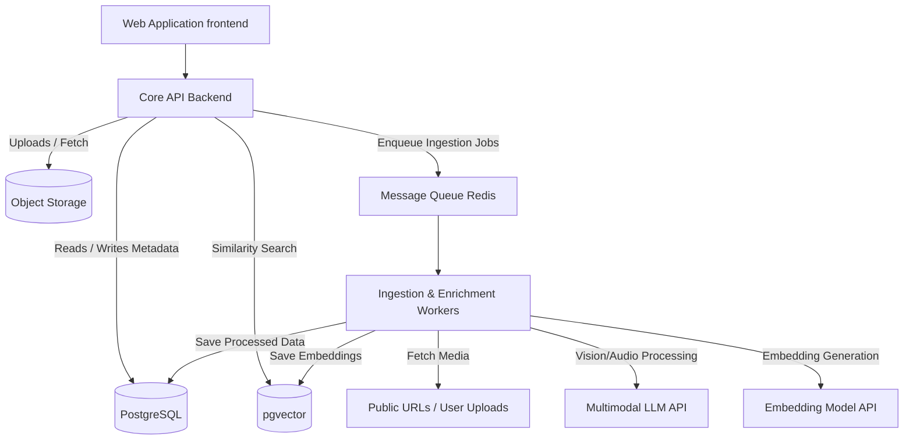

# ReelVault Design & Specification Document

## 1. System Architecture

The ReelVault architecture is designed to securely and efficiently process external and uploaded content into a highly searchable, personalized semantic index. All components run completely segregated by user ID.



**Components:**
- **Web Frontend:** A lightweight SPA/SSR web app for the fast, interactive UI.
- **Core API Backend:** Handles authentication, CRUD operations for the vault, triggers background jobs, and serves real-time search queries.
- **Message Queue & Workers:** Asynchronous processing is necessary because AI inference, OCR, and media fetching take varying amounts of time and should not block the main API.
- **Relational + Vector Database:** A unified database (like PostgreSQL with the `pgvector` extension) securely stores user metadata and high-dimensional embeddings.
- **Object Storage:** Stores parsed thumbnails, temporary user-uploaded archives, and screenshots securely.

## 2. Data Flow Description

### Mode A: Start Fresh (Single URL/File)
1. **Input:** User submits a public URL or uploads a media file.
2. **API Receipt:** API validates the payload, creates a pending `SavedItem` record in the database, and pushes a job to the Message Queue.
3. **Extraction & Download:** The Worker picks up the job. For URLs, it fetches the public DOM/metadata or uses CLI tools to extract the raw media stream (if public).
4. **Enrichment:**
   - *OCR & Vision:* Extracts readable text and describes scenes using a Vision LLM.
   - *Audio:* Extracts transcript via Speech-to-Text (if applicable).
   - *Metadata generation:* Synthesizes a clean description, tags, and category from the raw data.
   - *Embedding:* Generates a dense vector embedding of the combined textual context.
5. **Storage:** The Worker updates the `SavedItem` in the DB with the generated metadata, stores the embedding vector, uploads the thumbnail to Object Storage, and marks the status as `indexed`.
6. **Notification:** The client UI reflects the newly available searchable item.

### Mode B: Import Instagram Saves (ZIP Archive)
1. **Upload:** User provides the Instagram Data Export ZIP via a streaming upload to the API, which writes it securely to an S3 bucket and queues an archive-parsing job.
2. **Parsing:** Worker extracts `.json` files inside the ZIP (e.g., `saved_posts.json`), locating all URLs and original save timestamps.
3. **Deduplication:** A DB check filters out URLs already present in the user's vault.
4. **Fan-out Ingestion:** The worker enqueues hundreds of individual ingestion jobs (like Mode A) for each deduplicated post.
5. **Progress Tracking:** Continually updates a generic `ImportJob` DB record tracking `total`, `processed`, `failed`, and `duplicate` counts, which the UI polls to show visual progress.

### Semantic Search Flow
1. User types query (e.g., "startup advice by indian guy").
2. API converts the text query to an embedding vector.
3. PostgreSQL executes a fast cosine similarity search (`ORDER BY embedding <=> query_vector`) strictly `WHERE user_id = current_user`.
4. API retrieves top 20 matches in < 100ms, formatted for the dashboard grid.

## 3. Recommended Tech Stack

- **Frontend:** **Next.js (React)** with **Tailwind CSS**. Next.js provides excellent SSR routing and Server Actions for fast load times and clean component architecture.
- **Backend / Workers:** **Python (FastAPI)**. Python is highly recommended here due to its native dominance for AI and media frameworks (e.g., OpenAI SDKs, `yt-dlp` for public URL parsing, `whisper`). Use Celery or RQ (Redis Queue) for asynchronous workers.
- **Database:** **PostgreSQL + pgvector**. Extremely mature, scalable, and natively supports vector search alongside standard relational capabilities.
- **Object Storage:** **AWS S3** or **Cloudflare R2** for storing user-uploaded ZIP files, direct media uploads, and extracted thumbnails.
- **AI Models:** 
  - *Vision/Text:* `gpt-4o-mini` or `claude-3-haiku` (Highly capable multimodal models that handle rapid instruction following cheaply).
  - *Embeddings:* `text-embedding-3-small` (OpenAI).
  - *Audio:* OpenAI Whisper API.

## 4. Implementation Plan

**Phase 1: Foundation & Infrastructure**
- Set up DB schema (`User`, `SavedItem`, `ImportTask`).
- Initialize FastAPI backend, Next.js frontend repository, and background worker environment.
- Implement User Authentication with secure JWTs.

**Phase 2: Core Ingestion & Content Pipeline**
- Build the Celery/RQ Worker service.
- Implement media abstraction to handle grabbing public URLs vs processing uploaded files.
- Integrate LLM APIs to generate descriptions, tags, and categories.

**Phase 3: Search & Vault Management**
- Implement semantic similarity search algorithm via pgvector.
- Develop the Vault Dashboard UI: masonry grid view, detail modal, and the search bar.
- Connect Search UI to FastAPI endpoint.

**Phase 4: Instagram Data Import**
- Implement the ZIP upload and `saved_posts.json` parsing logic securely.
- Create fan-out bulk job creation and URL deduplication flow.
- Build UI components for tracking import progress and summarizing results.

**Phase 5: MVP Launch & Compliance Polish**
- Add user account controls: "Delete All Data" cascade route ensuring privacy compliance.
- UI empty states, edge case error handling (broken links/deleted videos), and responsive testing.

## 5. Pseudocode for Ingestion Pipeline

```python
def process_saved_item(item_id: str, source_input: str, is_url: bool):
    item = db.get_item(item_id)
    try:
        # Step 1: Media acquisition
        if is_url:
            media_data, original_metadata = fetch_public_media(source_input)
        else:
            media_data = storage.download(source_input)
            original_metadata = extract_file_metadata(media_data)
        
        # Step 2: Vision & Multimodal Extraction
        vision_prompt = "Describe actions, subjects, and transcribe any visible on-screen text."
        scene_desc, ocr_text = multimodal_llm.analyze(media_data.keyframes, prompt=vision_prompt)
        
        # Step 3: Audio Extraction
        transcript = ""
        if has_audio(media_data):
            transcript = whisper_api.transcribe(media_data.audio_track)
            
        # Step 4: Context Synthesis
        synthesis_prompt = format_prompt(original_metadata, scene_desc, ocr_text, transcript)
        enriched_data = text_llm.generate_json(synthesis_prompt, schema=EnrichmentSchema)
        # Yields: description, tags[5-15], category
        
        # Step 5: Semantic Embedding
        context_string = f"{enriched_data.description} {ocr_text} {transcript} {' '.join(enriched_data.tags)}"
        vector = embedding_model.embed(context_string)
        
        # Step 6: Persist output
        item.description = enriched_data.description
        item.tags = enriched_data.tags
        item.category = enriched_data.category
        item.thumbnail_url = upload_to_cdn(media_data.thumbnail)
        item.embedding_vector = vector
        item.status = "COMPLETED"
        db.save(item)
        
    except Exception as e:
        item.status = "FAILED"
        item.error_message = str(e)
        db.save(item)
```

## 6. Deployment Strategy

- **Frontend:** Vercel. Optimizes Next.js deployments flawlessly and provides excellent edge caching latency for the UI.
- **Backend & Workers:** Render or Railway (PaaS). They natively support deploying FastAPI and Celery workers via Docker and provisioning Redis instances with easy scaling rules.
- **Database:** Supabase. Offers Postgres, authentication, connection pooling, and the pgvector extension out of the box with competitive pricing.
- **Storage:** Cloudflare R2. Zero egress fees, perfect for a media-referencing app where thousands of thumbnails are constantly requested.

## 7. Scaling Roadmap

**0 - 10,000 Items (MVP Target)**
- Single backend instance, standard single-node Redis, 2 worker node concurrency.
- Unpartitioned pgvector table using an HNSW index handles exact relevance filtering effortlessly.

**10,000 - 100,000 Items**
- **Compute Scaling:** Scale out Python worker instances horizontally to prevent user archive imports from stalling standard real-time saves.
- **Batch Embedding:** Use batched arrays when hitting embedding APIs during bulk IG import tasks to significantly speed up processing and cut latency.

**100,000 - 1,000,000+ Items**
- **DB Optimization:** Transition database tables to partition by `user_id`. Vector search latency strictly bounds to individual user data rather than filtering a massive global index, effectively maintaining <50ms query speeds forever.
- **Intelligent Media Proxying:** Instead of full media extractions, use chunked stream processing to only read the first few keyframes, avoiding downloading complete GB-sized videos and drastically dropping egress bandwidth.
- **Result Caching:** Cache common search term vectors and popular tag distributions per user via Redis.

---

> [!IMPORTANT]
> **Data Privacy & Compliance Safety**  
> Using third-party AI APIs (such as OpenAI models or Anthropic via enterprise/developer tiers) is completely safe for this MVP. These APIs strictly discard prompts/inputs after inference and **do not** use user submissions for model training, satisfying the "Privacy-safe and compliant" criteria gracefully.
